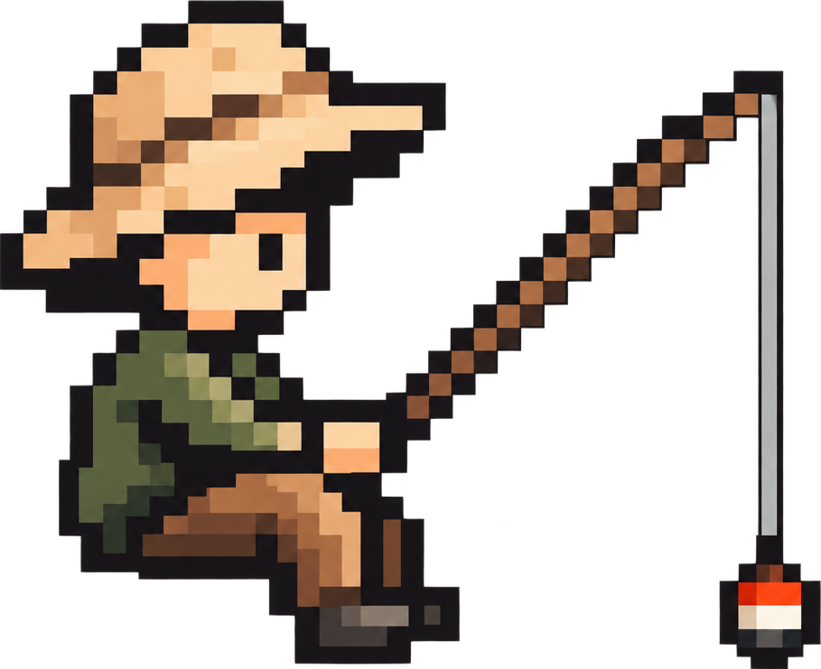

<div align="center">

#  OpenRod

**One-click sandboxes for AI agents, built on [NVIDIA OpenShell](https://github.com/NVIDIA/OpenShell).**
Create sandboxes, edit policy, and open agent sessions from one place, running on your own machine.

[](https://github.com/OpenRod/OpenRod/actions/workflows/ci.yml)
[](https://www.npmjs.com/package/openrod)
[](LICENSE)

</div>

---

### ✨ What you can do

| | |
| --- | --- |
| 📦 **Sandboxes & templates** | Create, manage and build image templates |
| 💻 **Agent sessions** | Open in the browser, your terminal, VS Code or Cursor |
| 🛡️ **Network policy** | Edit egress rules and policy templates |
| 🔌 **MCP servers & Skills** | Bring your own into any sandbox |
| 📜 **Activity** | Review what happened inside a sandbox |
| 🌐 **Remote hosts** | Run a persistent gateway on a Linux box over SSH, so work continues while your laptop sleeps |

---

### 🚀 Quick start

**You'll need**

- Node.js **22.13+**
- macOS (Apple Silicon) or Linux
- OpenShell **0.1.2** with a local gateway (`npx openrod` offers to install it)
- Docker, running: [Docker Desktop](https://docs.docker.com/desktop/) on macOS (`brew install --cask docker-desktop`, then open it once) or [Docker Engine](https://docs.docker.com/engine/install/) on Linux. OpenRod builds sandbox images with it, including for Quick setup.
- OpenSSH and OpenSSL

**1. Install and start Docker** (on Linux, install [Docker Engine](https://docs.docker.com/engine/install/) instead)

```bash
brew install --cask docker-desktop && open -a Docker
```

**2. Run OpenRod.** If OpenShell is missing, it offers to install 0.1.2. On macOS that uses Homebrew, and sandboxes run in VMs.

```bash
npx openrod
```

<details>
<summary>Install OpenShell yourself instead</summary>

```bash
curl -LsSf https://raw.githubusercontent.com/NVIDIA/OpenShell/v0.1.2/install.sh | OPENSHELL_VERSION=v0.1.2 sh
```

On macOS, also run sandboxes in VMs: the Docker driver a fresh install picks needs Docker Desktop's host networking, which is off by default.

```bash
brew install e2fsprogs
mkdir -p ~/.config/openshell && echo OPENSHELL_COMPUTE_DRIVER=vm >> ~/.config/openshell/gateway.env
brew services restart openshell
```

</details>

**3. Your browser opens the console.** Over SSH, or anywhere without a display, open the link it prints instead:

```text
OpenRod console (open this link): http://127.0.0.1:4600/?token=<secret>
```

**4. Connect your gateway.** Click **Use this computer**, and you're in.

> [!WARNING]
> Treat that link like a password. Anyone who has it while OpenRod is running can use your gateway credentials.

<details>
<summary><b>CLI options & install globally</b></summary>

```bash
npm install -g openrod
openrod
```

```text
--port <number>  HTTP port, 1–65535 (default: 4600)
--host <host>    Loopback only: 127.0.0.1 (default), localhost, or ::1
--open           Always open the console in your default browser
--no-open        Only print the link (the default over SSH, in CI or without a display)
--help, -h       Show help
--version, -v    Show the installed version
```

If `openshell` isn't on your `PATH`, set `OPENSHELL_BIN` to its full path. Gateway registrations are read from `~/.config/openshell/gateways/<name>/` (only HTTPS/mTLS); you never paste keys into the browser.

</details>

<details>
<summary><b>How the token link works</b></summary>

Every start generates a new random secret. The page stores it in an HttpOnly cookie and reloads without the token in the URL, so a bookmark of `http://127.0.0.1:4600/` keeps working until the console restarts. After a restart, OpenRod opens the new link for you; for another browser, copy it from your terminal.

</details>

---

### 🧭 Opening a sandbox

| Open in | How it works |
| --- | --- |
| **Browser** | xterm.js session in a new tab |
| **Terminal** | macOS Terminal or Linux `x-terminal-emulator` over SSH, a new session, or attach |
| **VS Code** | Shown on every sandbox; the first open allows VS Code's server download for that sandbox |
| **Cursor** | Shown when Cursor is one of the sandbox's agents |

Details: [docs/opening-sandboxes.md](docs/opening-sandboxes.md)

---

### 🌐 Remote SSH hosts

Run a persistent second gateway in Docker on a Linux machine you reach over SSH. Your local gateway is never reconfigured.

1. **New sandbox → Where should it run? → Remote machine**
2. Pick an SSH alias and click **Connect**
3. Sandboxes and templates now show **Local** and **SSH · host-alias** side by side

**Needs:** a `Host` alias in `~/.ssh/config`, a Linux amd64/arm64 host with rootful Docker, and Python 3.

📖 Full guide, offline runtime upload and reconnecting: [docs/remote-hosts.md](docs/remote-hosts.md)

---

### 🛠️ Troubleshooting

| Symptom | Fix |
| --- | --- |
| No SSH hosts | Add a concrete `Host my-host` entry to `~/.ssh/config`, then refresh |
| Host key or auth rejected | Run `ssh my-host` yourself and verify the host |
| `Docker isn’t running` or `Local Docker is required to build images` | Install or start Docker on this computer (Docker Desktop on macOS, Docker Engine on Linux), then click **Try again** |
| Docker missing or inaccessible on the SSH host | Install Docker Engine and grant the SSH user socket access |
| Local gateway missing | Run `npx openrod` again to install OpenShell, or register it: `openshell gateway add https://localhost:17670 --local --name openshell` (Linux: `https://127.0.0.1:17670`) |
| `failed to resolve vm sandbox image` … `Not authorized` | OpenShell can’t see the Docker that OpenRod builds with ([NVIDIA/OpenShell#4155](https://github.com/NVIDIA/OpenShell/issues/4155)). Click **Connect** (macOS Homebrew service) or **Show steps** on the sandbox, then delete it and create it again. Details: [SECURITY.md](SECURITY.md#local-gateway-docker-connection) |
| Sandbox not Ready | Inspect its conditions in the console |

More: [docs/remote-hosts.md#troubleshooting](docs/remote-hosts.md#troubleshooting)

---

### 💾 What gets saved

OpenRod keeps config in `~/.config/openshell` and state in `~/.local/state/openshell-console`. Activity history and webhook credentials are **not encrypted**.

With your opt-in, OpenRod sends a small set of usage metrics to PostHog to help us understand what works, where users get stuck, and what to improve. Manage sharing and submit feedback under **Usage & feedback**, or disable all collection with `OPENROD_TELEMETRY=0`. Offline or blocked delivery fails silently. [What we collect](docs/posthog.md).

📖 Full list of files and effects: [docs/data-and-state.md](docs/data-and-state.md)

---

### 🔒 Security

- **Your authority, your machine.** OpenRod can do whatever your gateway credentials allow. Keys stay on the server and never reach the browser.
- **Loopback only.** No login and no multi-user support. Don't proxy it or expose it on a LAN.
- **Per-launch token.** Every request, stream and WebSocket needs the HttpOnly cookie.
- **Local data is not a vault.** Protect your disk and backups.

Full threat model and vulnerability reporting: [SECURITY.md](SECURITY.md)

---

### 🧰 Development

```bash
cd ui
npm ci
npm run dev     # Vite dev server
npm test        # server and library tests
npm run build   # production frontend
```

See [CONTRIBUTING.md](CONTRIBUTING.md) · [docs/architecture.md](docs/architecture.md) · [ui/SETUPS.md](ui/SETUPS.md)

---

<div align="center">

[Apache-2.0](LICENSE) · Third-party notices in [ui/THIRD_PARTY_NOTICES.md](ui/THIRD_PARTY_NOTICES.md)

<sub>OpenRod is an independent community project, not affiliated with, endorsed by, or supported by NVIDIA. NVIDIA and OpenShell are trademarks of NVIDIA Corporation.</sub>

</div>
