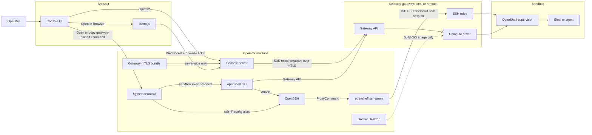

# OpenRod console internals

Feature and architecture reference for the OpenRod console in `ui/`: a React + Vite frontend (`ui/src/`) and a Node server (`ui/server/`) that holds the gateway credentials. For installation, prerequisites and the quick start, see the [project README](../README.md). Commands and paths below are relative to `ui/` unless stated otherwise.

```bash
cd ui
npm ci
npm run dev        # prints http://127.0.0.1:4600/?token=…; open that link
npm test           # server and library tests
npm run build && npm run start:local -- --open   # built console, as the installed CLI runs it
```

## First connection

1. On **Sandboxes**, click **New sandbox**. In **Where should it run?**, choose **This computer** for your existing local gateway, or **Remote machine** and a concrete alias from `~/.ssh/config` (including `Include` files).
2. For SSH, use trusted key-based access to a native Linux amd64/arm64 host with a rootful Docker Engine accessible to the SSH user. OpenShell need not already be installed.
3. Click **Connect**. Matching installed sandbox, supervisor and gateway images are reused; missing images can be pulled with **Download on host**, or supplied with **Upload** as a trusted `docker save` `.tar`. See [package preparation](remote-hosts.md#uploading-a-runtime-package).
4. The console starts a persistent Docker gateway **on the remote host**, with isolated state and certificates. It binds to remote loopback and uses host-local Docker; SSH forwards its authenticated API to your computer. The original local gateway is not reconfigured or stopped.
5. Successful activation selects an accessible workspace and reloads. Sandboxes and Templates retain the local inventory alongside the SSH inventory, with **Local** / **SSH · alias** badges and an **All locations** filter. New sandbox chooses a location explicitly; Use template inherits its owner.

Remote connections require local OpenSSH and OpenSSL. An existing `openshell-gateway` is reused; if absent, gateway 0.1.2 is downloaded automatically on Apple Silicon macOS or arm64/x64 Linux, checksum-verified, and installed under the console data directory (`tools/openshell-gateway-0.1.2/`) without sudo. Extraction requires `tar`. A pinned Docker gateway is created on the remote host. Python 3 must be installed on the remote host. When Docker is genuinely missing on Ubuntu/Debian with systemd, the dialog asks for **Install Docker and continue** approval before any privileged installation. Approval authorizes installing `docker.io` and dependencies, enabling its service, and granting the SSH user root-equivalent Docker group access; root or passwordless sudo is required. Existing installations are reused, never automatically replaced or repaired. A fresh SSH login verifies access, then the chosen runtime download/upload mode continues. Partial installation changes can remain after failure. A running local Docker daemon is required to build images, which Quick setup always does on your computer (also for SSH hosts), and to prepare an upload package locally.

One remote host is connected at a time. Disconnecting, switching remote hosts, or stopping the console server closes only the local SSH tunnels; the remote gateway container, its state and tmux sessions keep running. Reconnect explicitly after restarting the console. Gateway databases, policies and providers are separate; they are not automatically synchronized.

Resource actions—including details, files, terminals, policy changes, template builds and bulk deletion—are bound to the row's gateway/workspace. Same names on independent gateways remain separate. For SSH creation, local network-policy templates, Groups, and MCPs & Skills are offered automatically as versioned destination snapshots. Existing remote settings remain available. Workload-image templates and provider credentials remain location-specific. Disconnect retains the last remote inventory, marked **Disconnected** with actions disabled, while local resources stay usable. The private remote metadata cache survives console restart; reconnect explicitly to restore live state. Remote gateway and tmux sessions keep running while the viewer is disconnected, including laptop sleep. Console-built images include tmux; old/custom images need tmux and explicit PTY filesystem grants.

## Pages

- **Sandboxes**: a compact virtualized inventory table with sticky sortable columns, status counts, image and group filters, and search across the entire loaded fleet. Rows show name, status, owner, image, group, uptime, and creation age. Only viewport rows plus overscan are mounted; filtering and sorting are memoized separately from live traffic updates. A single click opens a centered popup with the access graph and a compact summary shown first. Rules, Activity, and Details tabs separate the longer content; navigation and lifecycle actions remain visible while each panel scrolls independently. The development-only `?fleet=1000` and `?fleet=10000` previews exercise large inventories without creating real sandboxes. This is client-side windowing over the loaded inventory, not server-side pagination. Owner comes from the owner field or labels; uptime requires a reported start time, and missing data is shown as “Not reported” instead of using creation age. A ready sandbox's **Open in** section has **VS Code** and **Cursor** buttons (enabled only for editors installed on this machine; **Cursor** appears only when Cursor is one of the sandbox's agents, since Cursor's remote connection needs Cursor in the sandbox; **VS Code** appears on every ready sandbox). VS Code downloads its version-matched server inside the sandbox, so before connecting the console adds the reviewed `tool-vscode-server` rule to that sandbox if it is missing (GET only, to `update.code.visualstudio.com` and `vscode.download.prss.microsoft.com`) and, where `wget` exists, a `ca_certificate` line for OpenShell's CA in the sandbox's `~/.wgetrc`; a sandbox with neither `curl` nor `wget` is refused (`server/editor.js`). They run `openshell sandbox connect <name> --editor …`, so OpenShell adds its managed SSH config (one `Include` line in `~/.ssh/config`, Host blocks in `~/.config/openshell/ssh_config`) and the editor connects over Remote-SSH. **Browser** runs the sandbox's session (its agent, or a shell) in a new browser tab: xterm.js in the page, a WebSocket to the console, and the gateway's interactive exec behind it (the RPC `openshell sandbox exec --tty` uses). The tab's menu starts another session as a shell or any installed agent. Each tab is one session, and it ends when the tab closes.
- **Approvals**: requests the gateway blocked and drafted rules for. Allow, reject with a reason, or revoke an earlier approval.
- **Activity**: retained, searchable logs and platform events with collection coverage, separate policy decisions and outcomes, evidence details, investigation pivots, saved views, and JSON export.
- **Gateway**: health, runtime, auth, providers, and a live traffic map.

### Security

- **Policies**: create-time policies (writable and read-only paths, Landlock mode, starting network rules), picked independently from the image in New sandbox. Built-ins plus your own, saved under the selected gateway/workspace's `policies/` data directory. Capture a running sandbox's rules, duplicate, or edit a policy. Existing group references and service-opening defaults are preserved. A policy is fixed once the sandbox exists; later network changes happen on the Network page.
- **Network**: one page with an **Egress** tab and an **Ingress** tab (`#egress`, `#ingress`).
- **Egress** (Network): reusable network rules. **Add rule** asks for a name, destinations (hosts, with `*.` and `**.` wildcards) and an action, Allow or Block, plus what it applies to: **Groups** (the default), **Specific sandboxes**, or **Every sandbox**. A group can be created right in the form. Below the choice, the form lists the sandboxes the rule reaches today. Sandboxes start locked down, so nothing leaves one until an allow rule covers it, and a block always beats an allow. Blocking a host also blocks its subdomains. **Advanced** (allow only) holds ports (default 443 and 80), requests (any, read only, read & write, or specific method/path pairs, plus blocked requests), programs (default any), enforce vs audit, and private addresses. Presets: GitHub read and clone, npm, PyPI. Saved as JSON in `policies/egress/`; saving re-applies the rule to every sandbox it covered before or after. The tab also lists destinations, recently blocked hosts (Allow opens a pre-filled rule) and each sandbox's rules and revisions, where one-off sandbox rules can still be added.
  - How a network rule maps to OpenShell: an allow is one OpenShell rule named `egress_<id>` with an endpoint per destination (no inspection unless Advanced asks for it) and binaries `/**` unless programs are set. OpenShell has no host-level deny, so a block is an inspected endpoint per host (and `**.host`) whose deny rules match every request, on every port the sandbox's rules open (allow rules, its policy, one-off rules and providers). It answers HTTP with `policy_denied` and refuses non-HTTP traffic.
  - "All destinations" (Open) is shown but disabled: OpenShell 0.1.2 rejects `*` hosts, and endpoints without a host only open IP addresses in the VM driver.
- **Groups**: sandboxes that share network access. Create a group on the Groups page (optionally adding sandboxes in the same step), inline in the rule form, or inline in the New sandbox dialog. Put a sandbox in a group from the Groups page (a group menu per sandbox, bulk **Move to**, or a group's panel), or pick the group when creating the sandbox; the dialog lists the network rules it will get. A sandbox is in one group at a time and can change groups whenever; its rules are rewritten right away. Network rules aimed at a group reach every sandbox in it, including ones added later. Deleting a group moves its sandboxes to No group; the sandboxes are kept.
  - Membership is stored by the console in scoped `policies/org/members.json`, not in the sandbox: gateway labels are fixed at creation. A sandbox with no stored membership falls back to the group label it was created with. Deleting a sandbox from the console forgets its membership, so a later sandbox with the same name starts ungrouped. Groups are saved in scoped `policies/org/groups/<id>.json`; one from before the console managed groups may pin a policy (`template`), which the New sandbox dialog shows.
- **Blocked everywhere** (top row of Network → Egress → Rules, and "Block everywhere" on a blocked host): hosts blocked in every sandbox in the selected context, with their subdomains, written into each one as the `org_blocked` rule. They override every rule. Saved in scoped `policies/org/organization.json`. Background reconciliation is disabled unless `OPENSHELL_CONSOLE_SWEEP=1`; when enabled, it runs every 15s only for the startup gateway/workspace. Switching contexts does not apply stored rules to another gateway.
- **Ingress** (Network): gateway-exposed services per sandbox. Open a port as a gateway URL with presets (dev server, Vite, Jupyter) and an auto-close timer, change its timer, or close it. Also shows terminal/exec sessions from the gateway's audit log. Policies can open services at start. Auto-close deadlines live in `ingress.json` under the console data directory, carry their originating gateway/workspace, and are enforced every 30s while the console is active. Persisted deadlines can resume on activation/restart; switching contexts does not cancel them.
- **Secrets**: add (masked, never shown again), rotate, set expiry, attach/detach, delete. Each secret shows exactly which hosts it can be sent to, how it's injected, and which programs may use it. Import NVIDIA's published provider profiles (pinned to v0.1.2).
- **Activity collection**: automatically collects and retains gateway events after activation while the console server runs, including with no browser open. A fresh unconfigured console and host discovery do not start collection. Export and Webhook are available in Activity. The separate gateway setting for sandbox OCSF JSON files remains available through the CLI; it does not control Activity collection and is not exposed as an Activity toggle. Legacy `#guardrails` links redirect to Activity.

Changes go through the gateway's server-side patch operations (`UpdateConfig.merge_operations`), so the gateway validates every edit before storing it.

## Image templates

The Templates page lists image templates. An image template is an OpenShell sandbox template (`openshell sandbox template create`), so the list is the gateway's own and `openshell sandbox create --template <name>` works too.

- One page: a name, the agents to install, an optional public repository and a runtime (Node.js, Python). Claude Code, Codex, OpenCode and Gemini CLI are shown; Pi, Cursor, Antigravity, Copilot, Kiro, Factory Droid and Aider are under **More agents**, and any other agent installs through setup commands. **Advanced** holds what the sandbox starts in (any installed agent opens as a session, or a shell, or a custom command), the OS, apt packages, setup commands, non-secret environment variables and the generated Dockerfile. **Use an existing image** takes an image on the selected Docker engine or a registry reference instead of building one.
- A build runs in local Docker (tagged `openshell-template/<name>:<id>`, as the non-root UID 1000 sandbox user), targeting the selected deployment engine’s architecture. For an SSH host, the console exports a temporary archive, loads it through the existing SSH Docker tunnel, and verifies the engine identity, image ID and platform before publishing. Local Docker must be running and support cross-platform builds when architectures differ. Existing remote images used as bases for MCP/Skill bundle layers are imported under temporary local tags without overwriting user tags. On success the console creates the OpenShell template in the originating gateway/workspace: image and environment go into the template itself; the recipe and start command go into the `openshell.console/recipe` annotation. Temporary archives/base tags are cleaned up; a running or failed build lives only in server memory.
- OpenShell has no template update. Editing rebuilds, then deletes and recreates the template under the same name. Existing sandboxes are unaffected. Published images remain in Docker because another workspace or gateway may still reference them; remove unused images explicitly through Docker. The gateway records the template each sandbox came from, but recreating resets the version, so sandboxes from before and after an edit both show `<name>@1`.
- Template and sandbox names follow OpenShell's rule: lowercase letters, digits and dashes, at most 19 characters.
- Built templates add each selected agent's sign-in and model destinations to the sandbox policy at launch, as rules named `agent-<id>` from the reviewed table in `shared/agent-access.js`; the launch dialog lists them per agent with any sign-in note. Agents such as Pi finish browser sign-in by redirecting to a `localhost` callback inside the sandbox, which the host browser can't reach: copy the full URL from the "site can't be reached" page, paste it into the agent's prompt and press Enter. Existing sandboxes keep the policy they were created with.
- Policies, providers and ingress are chosen in New sandbox, as before; OpenShell templates don't hold policy. CPU and memory aren't offered because the VM driver ignores per-sandbox limits. Templates created with the CLI show up and can be launched, but not edited here.

Run recipe checks with `node --test server/image-templates.test.js` from `ui/`.

## Sandbox attribution

New sandboxes created through this console store `openshell.console/created-by`
and `openshell.console/owner` in their gateway metadata labels. Both initially
identify the local OS account running the console server. Set
`OPENSHELL_CONSOLE_OPERATOR` before starting the server to use a specific user or
service ID instead. The server supplies these values; browser input cannot
choose the creator. Sandbox summary and Details show **Created by** separately
from **Owner**.

This is local operator attribution, not an authenticated browser user or an
immutable audit record. There is no owner reassignment UI yet. Existing sandboxes
and sandboxes created outside the console retain their existing metadata;
missing attribution displays “Not reported”.

## Files

- **Start with** in New sandbox: a local folder or a public git repository.
  - **Local folder:** the server reads a folder under your home folder. It refuses hidden folders such as `~/.ssh` and `~/.config`, `~/Library`, and any folder holding the gateway certificate. Before you create the sandbox it shows what will be sent: file count, size, whether `.gitignore` applied, and files that look like secrets (`.env`, `*.pem`).
  - Once the sandbox is ready, `openshell sandbox upload` puts the folder in `/sandbox/<folder>`, the same as `sandbox create --upload`. `.git` follows as a second upload, because the CLI's `.gitignore` filter leaves it out; worktrees and subfolders arrive without history.
  - **Git repository:** cloned inside the sandbox into `/sandbox/<repo>` with `git clone`. The policy must let git reach the host, and cloning needs POST to `/git-upload-pack`, so a GET-only GitHub rule is not enough.
  - Sessions open in the project folder (`--workdir`, stored as the `openshell.console/project` label). Progress and a Retry button are in the Files tab. Progress is kept in memory, so a console restart forgets it.
- **Files tab** in the sandbox popup:
  - Browse `/sandbox` (listed through `exec`: `realpath`, `find` and `stat`, at most 2,000 entries; nothing GNU-only, so busybox images work too).
  - Download a file, or a folder as `.tar.gz`: `cat` or `tar cf -` streamed out through the SDK's exec into a temp folder, then fetched once by token. (The CLI's `download` needs GNU `realpath -e` in the image, which busybox images lack.)
  - Drop files or folders to upload into the current folder. They are staged one request per file, then sent with one `openshell sandbox upload`. Uploads merge: same-name files are replaced after a confirmation, and nothing is deleted.
- **Limits:**
  - 1 GB per transfer, and never more than the sandbox's free space. The microVM disk is about 4 GB.
  - Only `/sandbox` is reachable, symlinks travel as links, and a link that resolves outside `/sandbox` is refused: the console resolves every path inside the sandbox before it lists, uploads or downloads.
  - Each transfer shows the matching `openshell` command, for anything larger or for scripting.
- Uploads use the CLI (tar over the gateway's SSH relay) because the SDK's `exec` accepts at most 4 MiB of stdin. The CLI must be on `PATH`, or set `OPENSHELL_BIN`.
- Tests: `node --test server/files.test.js`.

## How it connects

The browser talks only to `/api/os/*` on the local console server, in both
development and production. `server/` holds an `@nvidia/openshell-sdk` client
(built from OpenShell v0.1.2, vendored in `vendor/`) authenticated with the
selected CLI registration's mTLS bundle. **New sandbox → Where should it run?**
selects the existing local gateway or connects to the persistent gateway on an SSH host.
Workspace selection is automatic. Operator credentials never reach the browser,
and provider credential values are never returned.

The server binds to loopback only (127.0.0.1 by default). Every API route, the event stream and the
terminal WebSocket require the per-launch token cookie set by the printed `?token=` link
(see [SECURITY.md](../SECURITY.md#launch-token)). Every route also checks the socket, Host and
Origin, and each change additionally requires a same-origin POST with
an `x-openshell-console` header. Mutations use JSON, except bounded runtime-package and sandbox-file uploads, which stream binary bodies with the same origin/header checks.

### SSH connections

The connection picker talks to `/connections` and its job endpoints before a
gateway is active. It enumerates SSH aliases without connecting, probes only on
**Connect**, and automatically downloads missing runtime images unless upload mode was chosen. Missing Docker itself requires separate explicit approval.
The remote Docker Unix socket is forwarded to a private local Unix socket; the
second gateway binds loopback with TLS and has an isolated database and signing
keys. OpenShell 0.1.2 receives a separate supervisor mTLS key in its remote
supervisor-only volume, never either gateway's operator key.

Template builds for an SSH host run on the workstation's Docker engine for the
host's architecture, then load the image through the SSH Docker tunnel and verify
the engine identity, image ID and platform. **Use an existing image** checks or
pulls the reference on the remote engine instead.

The sandbox popup's **Connect** section uses the selected gateway and workspace.
Every generated CLI command includes both `--gateway <name>` and
`--workspace <name>`. Browser requests from stale selections are rejected;
already-open terminal sessions keep their original target.

- **Open in → Browser** keeps an SDK-backed `execInteractive` xterm session inside the console. This is not an OpenSSH connection and does not prove native SSH works.
- **Open in → Terminal** with **Connection options → SSH shell** launches actual OpenSSH
  using an owner-only temporary config, removed when SSH exits.
- **Connection options → New session** opens the sandbox's configured shell or agent in
  the project directory with `openshell sandbox exec --tty`.
- **Connection options → Attach** uses `openshell sandbox connect` for sandboxes whose
  canonical process owns a TTY. It is omitted otherwise.
- **SSH configuration** runs `openshell sandbox ssh-config` and displays the Host
  block for review and copying. It never changes `~/.ssh/config`. The existing
  editor action follows OpenShell's `sandbox connect --editor` behavior, which
  may install OpenShell's managed SSH config.

#### Connection architecture



There are three connection paths:

1. **Browser terminal:** the page obtains a one-use ticket, opens a WebSocket to
   the console server, and the server starts `execInteractive` through the SDK.
2. **Native OpenSSH:** the console generates an SSH config and opens
   `ssh -F <private-config> <alias>` in the system terminal. Its wrapper removes
   the config after exit. **Copy command** generates its own temporary config.
3. **New session or canonical attach:** `sandbox exec --tty` starts the configured
   program; `sandbox connect` attaches to a canonical TTY. Direct SSH uses
   `openshell ssh-proxy`, which authenticates to the selected gateway and
   requests an ephemeral relay session. Sandbox port 22 is never exposed.

**SSH configuration** asks the CLI to render the Host block and returns it to the
browser. The browser receives the gateway name, host alias, and command, but no
certificate private key or ephemeral relay token. The action does not write the
Host block; the operator may save it or use it as a temporary config:

```bash
(
  # Replace these with your activated context and a Ready sandbox.
  gateway='team-gateway'
  workspace='default'
  sandbox='my-sandbox'
  umask 077
  dir=$(mktemp -d) || exit
  trap 'rm -f "$dir/config"; rmdir "$dir"' EXIT
  "${OPENSHELL_BIN:-openshell}" --gateway "$gateway" --workspace "$workspace" \
    sandbox ssh-config "$sandbox" > "$dir/config" || exit
  ssh -F "$dir/config" "openshell-$sandbox.$workspace"
)
```

For a compatible mTLS registration, moving to a remote gateway changes the
selected endpoint and authentication material, not the SSH transport. A private
Kubernetes evaluation can use a loopback `kubectl port-forward`; the UI calls
that a local/tunnel endpoint even though the compute is remote. Kubernetes user
authentication is separate from transport TLS: shared/public deployments need
upstream OIDC or a trusted access proxy, which this console does not yet support.
Docker builds OCI images; it is not part of SSH transport.

Native terminal launch requires the `openshell` CLI and OpenSSH on the console
machine. Set `OPENSHELL_BIN` to an executable path when the CLI is not on
`PATH`. Opening a terminal is supported on macOS and Linux; other platforms can
copy the pinned command and generated config. The browser receives gateway
location metadata and commands, never mTLS material, SSH session tokens, or
provider credentials.

Focused checks:
`node --test server/openshell-cli.test.js server/editor.test.js server/files.test.js server/ssh.test.js server/terminal.test.js src/lib/sandbox-session.test.js`.

## Notes

- Sandboxes from a locally built image (such as `claude-sandbox:latest`) need
  Docker Desktop running when they are created. Otherwise the VM driver falls
  back to Docker Hub and the sandbox errors.
- Only approvals can be undone. Rejections are final; a rejected host shows
  up again only if the sandbox retries it.

### Installed agent detection

Opening a sandbox's graph or details runs a read-only executable inventory inside ready sandboxes and refreshes it every 30 seconds while open. This finds agents shipped in the image and subsequently installed agents, including removals. It checks PATH and common user installation directories for Claude Code, Codex, GitHub Copilot, Cursor Agent, Gemini CLI, OpenCode, OpenClaw, Pi, Antigravity CLI, Kiro CLI, Factory Droid, and Aider; custom names or locations outside these paths are not automatically discovered. No agent is launched and no credentials are read. A completed scan takes precedence over launch labels; failed/stopped scans retain the last process-cached result as last detected, and an empty successful scan is shown separately from an unavailable scan. Checks have a timeout and share a short cache across tabs. The inventory establishes executable presence, not authentication or agent health, and does not distinguish image provenance from later installation.

## Activity investigations and retention

Activity searches a gateway/workspace-scoped SQLite archive in the console data directory (Node 22.13+ required). Collection begins after a successful connection, or on startup for a saved/environment-selected context—not for a fresh CLI suggestion or SSH-host enumeration. Managed SSH transport must be reconnected explicitly after restart. The active context is collected even with no browser open; switching pauses the previous collector, and server shutdown stops collection. Existing archived records remain in their original context. There is no automatic expiry; this is a local investigation store, not an immutable external SIEM archive.

- Searches, category/severity filters, exact-match pivots, sorting, and time ranges apply to retained events on the server. Pages use a fixed ingestion snapshot and time anchor so new arrivals cannot shift subsequent pages. Export includes every matching retained event plus coverage metadata.
- Source cursors are saved after evidence is persisted and used to resume watches. Rejected cursors fall back to bounded replay (400 logs and 400 platform events); stream warnings and interruptions remain visible. Earlier history and unresolved gaps are never claimed complete.
- Policy decisions are separate from execution outcomes. A connection failure is not a policy denial. Events without verdicts and unknown formats remain searchable. Original source envelopes, structured fields, full request URLs, and nanosecond timestamps are retained.
- Observed agent labels come from executable-name matches, not authenticated initiator identity or installed-agent inventory. Parent process, initiating user/agent, session linkage, and policy revision at event time are shown as unreported unless the event supplies them. Current policy is never substituted for historical policy.
- History-only records use a scoped source-envelope fingerprint. Stream cursors distinguish otherwise identical source events; cursor aliases reconcile history replay. Sources are scoped by gateway, sandbox identity, and creation time. Collected events remain after sandbox removal.
- Saved views are browser-local. A copied view link contains filters, not evidence; it requires access to the same console archive. Custom time ranges are serialized as absolute instants.

Focused checks: `node --test server/activity-store.test.js server/activity-collector.test.js src/lib/activity-inventory.test.js src/lib/activity-targets.test.js` from `ui/`.


### Activity exports and destinations

Activity retains console-normalized records derived from the gateway log stream, not native OCSF JSON records. Export matching events supports the original console JSON envelope (including query and coverage) or an array of OCSF 1.4.0 Base Events. Downloads stream a fixed snapshot of all matching retained records. The OCSF adapter preserves original evidence in `raw_data` and console fields in `unmapped.openshell`; it does not infer specialized network/authentication classes. Collection time is used only when source time is missing, explicitly marked in `unmapped.time_basis`. A permitted connection is not treated as a successful operation.

**Activity → Export → Webhook** configures public HTTPS JSON ingestion endpoints with no auth, Bearer, or X-API-Key authentication. Each POST contains one console event or one OCSF Base Event; proprietary SIEM envelopes require an adapter. The receiver must accept the selected format. Synthetic tests contain no sandbox data, and HTTP 2xx acceptance is not proof of SIEM indexing.

Destinations are saved paused, with a cursor starting at creation (no automatic historical backfill). Enable forwarding to send all subsequent matching events, including those collected while paused. Filters cover sandbox names, event categories, and decisions. The server sends independently of browser tabs, resuming persisted positions after restarts. Failed events block later delivery to that destination, retry exponentially up to five minutes, and pause after eight failures. Retry/enable resumes the same event; pause retains the position. Delivery is at least once, with a stable event ID and `Idempotency-Key` for receiver deduplication. Removing a destination discards its position and credential but preserves Activity history.

Configuration, credentials, delivery positions, counters, and latest test/failure status live in the selected context's `activity-delivery.sqlite` (owner-only permissions; credentials are not encrypted at rest and never returned by the API). No destination is configured automatically. Previously configured enabled delivery can resume when its context activates or reconnects on restart; delivery workers may continue sending their original context's pending events after selection changes. Host enumeration does not create or start these workers. HTTPS requests validate certificates, reject redirects and nonpublic addresses, pin DNS resolution per attempt, and have a 10-second request timeout and 1 MB event limit. There is no separate daemon: collection and delivery require the console server to be running; upstream collection gaps still apply.

Validation: `node --test server/activity-delivery.test.js server/activity-store.test.js server/activity-collector.test.js src/lib/activity-inventory.test.js src/lib/activity-targets.test.js`.


### Deleting retained activity

Activity's **Delete** menu offers selected logs (up to 5,000 IDs), all matching logs across every retained page, or all retained logs regardless of filters. Individual event details also have **Delete log**. The header checkbox selects loaded rows only; changing filters clears selection. Synthetic demo data does not expose archive deletion controls.

Each operation first reviews a server-calculated count and a fixed ingestion snapshot. A five-minute, single-use review token is required to confirm. New arrivals after the review are preserved. Deletion removes records from the local archive and pending webhook delivery; source logs, downloaded exports, and remote SIEM copies are unchanged. An outbound request already sent may still arrive. Existing collection continues, and all connected browser caches and paginated history are refreshed, including paused views.

Opaque event fingerprints and cursor aliases remain to prevent deleted events being reimported by upstream replay. Source resume cursors and the monotonically increasing archive sequence are preserved. This is deletion from the console history, not forensic erasure of database files or backups. Restart, replay suppression, exact filtering, all-page deletion, frozen previews, and webhook cancellation are covered by `node --test server/activity-deletion.test.js`.

## MCP and Skill Setups

**Setups → Bring my setup** discovers user-level Codex, Claude Code and Cursor configuration on the computer running the console. Discovery is explicitly requested, does not change the source files, and has no background watcher. Only selected skill folders are read in full for review. Project configurations and plugin-managed sources are not included.

The review excludes MCP environment values, auth headers and tokens, shows portable configuration and build/runtime requirements, and provides text-only previews of selected skill files. Secret detection is best-effort: inspect the files before saving. Unsupported launchers, credential-dependent configurations, binary assets and unsafe links remain visibly blocked. Saving stores a reviewed snapshot in the scoped state directory (`contexts/<scope-hash>/setups/`) with private file permissions. Deleting an MCP or Skill row saves a new revision; deleting an entire Setup removes its catalog snapshot. Both operations preserve source files and tools already deployed to sandboxes or built images. Templates referencing a deleted Setup need their selection updated before reuse. Changed source files require another import.

- **Existing sandboxes:** select agents and check requirements. Enabling writes namespaced MCP entries and skill folders, preserves unrelated settings, and records an ownership manifest. Reapplying is idempotent; removal refuses to overwrite modified managed files. Python 3.11+ and the selected agents must already be installed. Restart the agents after changes.
- **Image templates:** select saved Setups to bake inactive JSON bundles into `/sandbox/.openshell/bundles/`. Imported commands and scripts are not executed during the build. Wrapping an existing image uses `--network=none`; normal base-image/agent installation still follows the existing image builder. Destination-specific build-egress enforcement is not implemented.
- **New sandboxes:** both Quick setup and From template show the MCPs & Skills picker. Quick setup targets all selected supported agents and prepares Python for the installer. From template lets you choose the target agent; the image must already include that agent and Python 3.11+. Blocked imports expose their reasons in the picker. Inherited and explicitly selected Setups start in Shell, then install after readiness and a fresh policy check. Missing executables or blocked destinations leave an actionable blocked status in Setups. A missing catalog snapshot fails launch instead of silently substituting another revision.
- **Network:** saving a Setup creates or updates a managed egress allow policy named "MCPs & Skills: <name>" for the sandboxes that use it, listing the hosts its active MCPs reach at runtime; enabling or removing the Setup on a sandbox adds it to or takes it out of that policy. Hosts that receive credentials are approved per sandbox instead. Organization blocks still apply. See [SETUPS.md](../ui/SETUPS.md#network-access). Skills and local servers can have unknown downstream destinations, which remain subject to the sandbox policy.

This version is a private local-operator catalog, not organization/group distribution. Background synchronization with the source files and MCP tool-call testing are not implemented. “Installed” verifies configuration and file contents; it does not mean authenticated, reachable or tool-call verified. Pending launch jobs live in the console process; after a restart, check and enable from the sandbox's Setups tab.

Run regression checks with `node --test ui/server/*.test.js ui/src/lib/*.test.js` from the repository root and `npm --prefix ui run build`. Setup tests cover snapshot pinning, secret exclusion, invalid/expired selections, file limits, links, configuration preservation, executable permissions, drift-safe removal, network preflight and image recipes. Live verification additionally exercised discovery/review/save in the browser, install/reapply/remove in an isolated sandbox, blocked runtime access without policy changes, and image-to-new-sandbox inheritance.

## Console data directory

Mutable state lives under `$XDG_STATE_HOME/openshell-console`, or
`~/.local/state/openshell-console`; override with `OPENSHELL_CONSOLE_DATA_DIR`.
Gateway/workspace state is stored in `contexts/<scope-hash>/`, including
`activity.sqlite`, `activity-delivery.sqlite`, and `policies/` with organization
rules and memberships. SQLite companion files can exist alongside the databases.
Service auto-close deadlines are stored separately in the root `ingress.json`,
with their originating context. File jobs and image builds retain their originating
context. Installed packages never write into their own directory and exclude
checkout policies and databases.

Managed remote-work gateways keep isolated configuration, databases and keys in
`remote-gateways/console-ssh-<host-and-engine-hash>/`. Disconnecting does not
delete this state or the remote engine's containers/volumes.

Legacy checkout policies migrate once only for the original local loopback
`openshell/default` registration. Old `ui/.state` activity databases are left
untouched; they are not silently reassigned to another gateway.
Organization-policy reconciliation is off unless `OPENSHELL_CONSOLE_SWEEP=1`,
and then stays bound to the startup context. Explicit policy edits still apply
immediately.

### OpenShell registration and console selection

`$XDG_CONFIG_HOME/openshell`, otherwise `~/.config/openshell`, holds the CLI and console's shared configuration:

- `gateways/NAME/metadata.json`: CLI registration endpoint/authentication metadata.
- `gateways/NAME/mtls/{ca.crt,tls.crt,tls.key}`: server-side credential files.
- `active_gateway`: the CLI's active gateway, only a suggestion for a fresh console.
- `console-context.json`: the console's owner-only selection file, written by activation.

Gateway selection precedence is `OPENSHELL_GATEWAY`, saved console gateway,
CLI active gateway suggestion, then `openshell` suggestion. Workspace precedence
is `OPENSHELL_WORKSPACE`, saved workspace, then `default`. Environment variables
pin their respective fields; restart without them to change those fields in the
UI. `OPENSHELL_WORKSPACE` alone does not activate a fresh console.
Saved console selections and environment-pinned gateways start their background
workers on restart, allowing configured deliveries/deadlines to resume.
The app-managed SSH gateway and tunnels require explicit reconnection.
Opening the connection dialog is not a global pause.

Selection is shared by all tabs connected to the process. It does not rewrite
the CLI active gateway. Existing sessions remain pinned to their original context;
stale requests are rejected. See the [persistence summary](data-and-state.md)
and [security guidance](../SECURITY.md) before activating a sensitive gateway.
